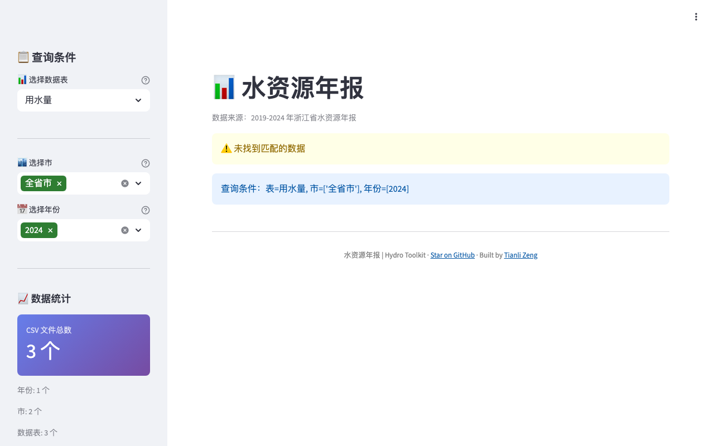

# 📊 Hydro Annual — Water Annual Report

[](https://github.com/zengtianli/hydro-annual)
[](LICENSE)
[](https://python.org)
[](https://streamlit.io)
[](https://hydro-annual.tianlizeng.cloud)

Zhejiang Province water resources annual report data query and export tool (2019–2024).



## Features

- **Multi-year query** — browse water resource data from 2019 to 2024
- **City & table filtering** — filter by city (prefecture-level) and report category
- **Data overview** — summary statistics and record counts at a glance
- **Excel / CSV export** — download filtered results in Excel or CSV format
- **Built-in dataset** — pre-loaded CSV data, no upload required

## Quick Start

```bash
git clone https://github.com/zengtianli/hydro-annual.git
cd hydro-annual
pip install -r requirements.txt
streamlit run app.py
```

## Deploy (VPS)

```bash
git clone https://github.com/zengtianli/hydro-annual.git
cd hydro-annual
pip install -r requirements.txt
nohup streamlit run app.py --server.port 8504 --server.headless true &
```

## Hydro Toolkit Plugin

This project is a plugin for [Hydro Toolkit](https://github.com/zengtianli/hydro-toolkit) and can also run standalone. Install it in the Toolkit by pasting this repo URL in the Plugin Manager. You can also **[try it online](https://hydro-annual.tianlizeng.cloud)** — no install needed.

## License

MIT
